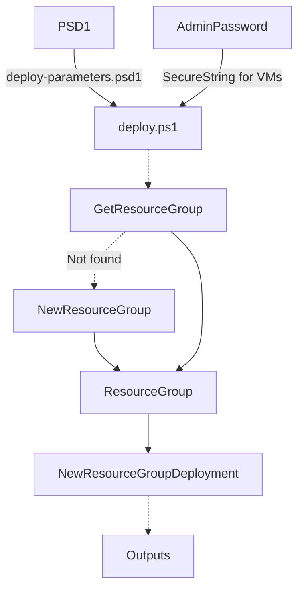
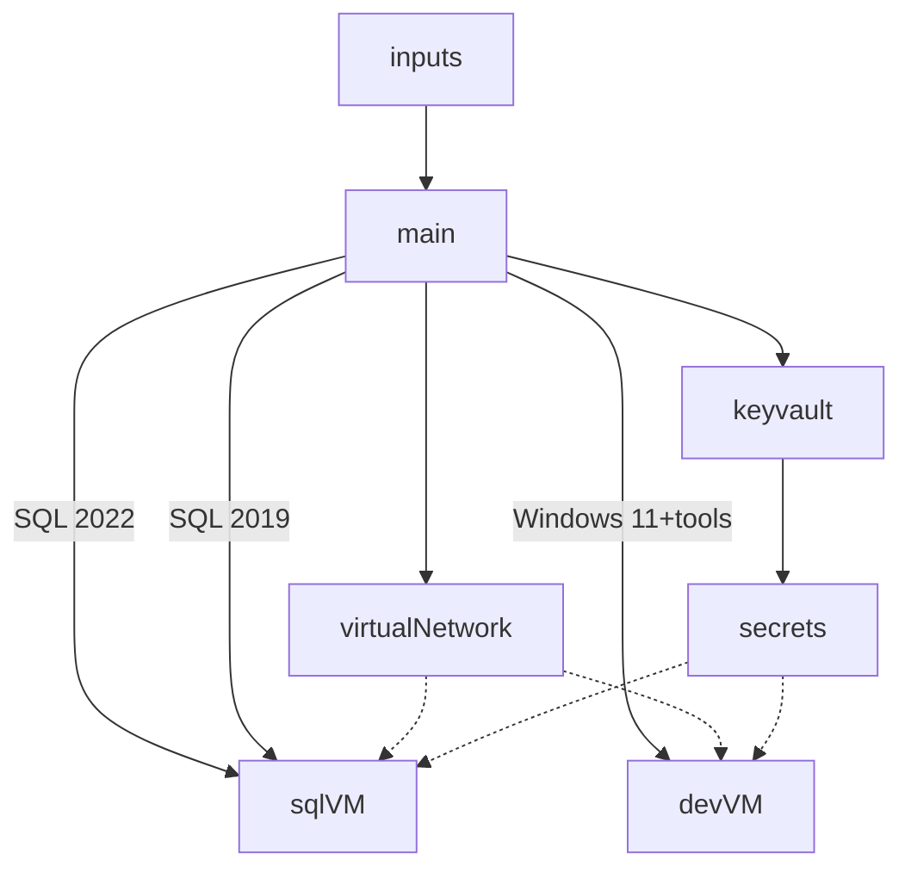

# dbatools Azure Lab Deployment

This repository contains an Azure Bicep deployment that will provide a quick start lab to work with SQL Server and testing or developing against the [dbatools module](https://github.com/dataplat/dbatools).

## Why no Deploy to Azure button?

The [Deploy to Azure](https://azure.microsoft.com/en-gb/blog/deploy-to-azure-button-for-azure-websites-2/) button is commonly used with repositories on GitHub. It is not commonly used internally with companies that are creating the DevOps process and writing CI/CD deployments. The intention is to show and provide a real-world deployment for SQL Server and resources in Azure.

## Getting Started

Clone the repository and then create the file `deploy-parameters.psd1` in the root directory. You can see sample content below for the PSD1 file.

```powershell
@{
    tenantId = '00000000-0000-000b-aa0a-000a000c0000'
    subscriptionId = '00000000-0000-000b-aa0a-000a000c0000'
    location = 'eastus'
    baseName = 'lab'
    emailAddress = '<an email address>'
    vmCount = 1
    adminUser = 'labadmin'
    timezone = 'Central Standard Time'
    userId = '00000000-0000-0000-0000-000000000000'
}
```

> **Note**: The User ID should by the ObjectID of your Azure AD account. This account requires Contributor role to either the subscription **or** a current Resource Group in the Azure Subscription

The [deploy.ps1](deploy.ps1) script is the entry point for deploying these resources to an Azure Subscription.


If everything completes successfully you will see output as below:


## Deployment Process

A PSD1 file is used to input parameters to the Bicep template.

- baseName: [required] value used in naming resources
- location: [required] region to deploy to in Azure
- tenantId: [required] Azure Tenant ID
- subscriptionId: [required] Azure Subscription ID
- tags: [optional] Hashtable object of tag key/value pairs to assign to the resources

The subscription and tenant values are used to validate the context for Azure PowerShell session.

## Deploy Script



## Bicep

[Bicep](https://github.com/azure/bicep) is a domain-specific language used to more easily define a resource to be deployed and configured in Azure. During the deployment process Azure Resource Manager (ARM) commands convert Bicep into an ARM template. If you have worked with creating ARM templates you will find that the syntax around string manipulation, calculations, and generating variables is much simplier in Bicep.



The structure of this deployment is using a module structure. Bicep templates can be reused as a module by adjusting to accept parameter inputs. The SQL VM module is written where you can provide a count input and it will loop over creating that number of VMs for you. By default you will only get one each of the following running Windows Server 2022.

- SQL Server 2022 Developer Edition
- SQL Server 2019 Developer Edition
